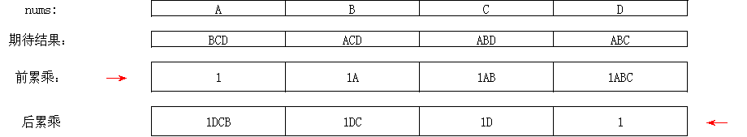

# 除自身以外数组的乘积

## 🚎 描述
给你一个整数数组 nums，返回数组 answer ，其中 answer[i] 等于 nums 中除 nums[i] 之外其余各元素的乘积。

题目数据保证数组 nums之中任意元素的全部前缀元素和后缀的乘积都在  32 位 整数范围内。请不要使用除法，且在 O(n) 时间复杂度内完成此题。
<br>
<br>
 
## 🛶 自写
#### 🧱 思路总结
不包括自身，那就是前面累乘的结果 X 后面累乘的结果，如下图所示：

- 记录每个`nums`数组前累乘的结果，和后累乘的结果，然后相乘即可得到期待的结果
- 利用前遍历`nums`数组，可以得到前累乘的结果
- 利用后遍历`nums`数组，可以得到后累乘的结果

下面的所有代码本质上都是这个思路，只是在存储的前累乘和后累乘的方法有所不同

<br>
 
#### 🏖 代码


```
class Solution(object):
    def productExceptSelf(self, nums):
        """
        :type nums: List[int]
        :rtype: List[int]
        """
        prenums = [1]*len(nums)
        postnums = [1]*len(nums)
        res = []
        for i in range(0,len(nums)):
            if i == 0:
                prenums[i] = 1
            else:
                prenums[i] = nums[i-1] * prenums[i-1]

        for i in range(len(nums)-1,-1,-1):
            if i == len(nums)-1:
                postnums[i] = 1
            else:
                postnums[i] = nums[i+1] * postnums[i+1]
         
        for  i in range(len(nums)):
            res.append(prenums[i]*postnums[i])

        return res
```

 
<br>
<br>
<br>
 
## 🛫 参考
#### 🌒 解题思路一：

- 将第三个循环与第二个循环合并在一起,
- 利用`prefix`变量记录前缀乘积
- 利用`postfix`变量记录后缀乘积

<br>

```
class Solution(object):
    def productExceptSelf(self, nums):
        """
        :type nums: List[int]
        :rtype: List[int]
        """
        prenums = [1]*len(nums)
        postnums = [1]*len(nums)
        res = [1]*len(nums)
        prefix = 1
        for i in range(0,len(nums)):
            prenums[i] = prefix
            prefix *= nums[i] 

        postfix = 1
        for i in range(len(nums)-1,-1,-1):
            postnums[i] = postfix
            postfix *= nums[i]
            res[i] = prenums[i] * postnums[i]
        return res
```

<br>
 
#### 🌓 解题思路二：

- 减少两个记录前后缀的数组，以`res数组`直接记录

>- 计算输入数组nums的每个元素前面所有元素的乘积，存储在结果数组res中。
>- 使用一个变量prefix来记录前缀乘积，初始值为1，遍历nums数组，将prefix乘积存储>在res数组对应位置上，然后将prefix乘以当前元素值。
>- 计算输入数组nums的每个元素后面所有元素的乘积，并更新结果数组res。
>- 使用一个变量postfix来记录后缀乘积，初始值为1，从nums数组末尾开始遍历，将postfix乘积与res数组对应位置的值相乘，然后将postfix乘以当前元素值。
>- 最后返回结果数组result作为答案。

<br>

```
class Solution:
    def productExceptSelf(self, nums: List[int]) -> List[int]:
        res = [1] * (len(nums))
        prefix = 1
        for i in range(len(nums)):
            res[i] = prefix
            prefix *= nums[i]
        postfix = 1
        for i in range(len(nums) - 1, -1, -1):
            res[i] *= postfix
            postfix *= nums[i]
        return res

```
<br>
 
#### 🌖 解题思路三：
今天看朋友的代码，又学到了一种简洁的代码写法，思路和方法二一样：

```
class Solution(object):
    def productExceptSelf(self, nums):
        """
        :type nums: List[int]
        :rtype: List[int]
        """
        res = [1]
        prefix ,postfix = 1 , 1
        for i in range(len(nums)-1):
            prefix *= nums[i] 
            res.append(prefix)
        for i in range(len(nums)-1,0,-1):
            postfix *= nums[i]
            res[i-1] *= postfix
        return res
```
 
<br>
<br>
<br> 

 
 
## 🐞 遇到的BUG
```
if i == 0:
    prenums[i] = 1
```
错误提示：` IndexError: list assignment index out of range`
>原因：list是一个空列表，没有一个元素，进行list[0]就会出现错误！所以列表需要进行提取操作时要保证不为空，定义的时候最好是`prenums = [1]*len(nums)`

<br>
<br>
<br>


## 🌊 反思环节
对于累乘，且需要特殊考虑下标为0元素的情况，可以在循环外部设置专门记录累乘结果的变量，且初始设置为1

 
<br>
<br>
<br>
 
## 🔁 重刷复习
 
<br>
 
### 📅 重刷时间：2023/8/14
#### 🏖 代码
```
class Solution(object):
    def productExceptSelf(self, nums):
        """
        :type nums: List[int]
        :rtype: List[int]
        """
        rel = [1]
        pre,pone = 1,1
        for i in range(len(nums)-1):
            pre *= nums[i]
            rel.append(pre)
        for j in range(len(nums)-1,-1,-1):
            rel[j] *= pone
            pone *= nums[j]
        return rel
```
#### 🎶 心理感受
总体思路没问题，前后两次遍历，但是第二次遍历的时候要注意是到-1结束，因为每个位置都要和后累乘相乘，所以必须是`len(nums)-1 -> 0`，而`range()`不包括结尾，所以是-1结束
 
<br>