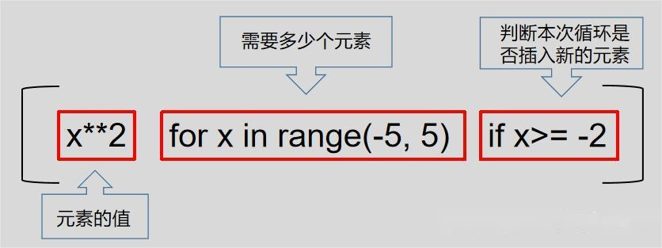

# 347前 K 个高频元素
<br>

## 🚎 描述
给你一个整数数组 nums 和一个整数 k ，请你返回其中出现频率前 k 高的元素。你可以按任意顺序返回答案。
 
<br>
<br>

## 🛶 自写
#### 🧱 思路总结

 
<br>
 
#### 🏖 代码
```
class Solution(object):
    def topKFrequent(self, nums, k):
        """
        :type nums: List[int]
        :type k: int
        :rtype: List[int]
        """
        ndict = {}
        reslist = [[] for i in range(len(nums)+1)]
        output = []
        for n in nums:
            ndict[n] = 1 + ndict.get(n,0)
        for val , freq in ndict.items():
            reslist[freq].append(val)
        for i in range(len(reslist)-1,0,-1):
            for f in reslist[i]:
                output.append(f)
                if len(output) == k:
                    return output

```
 
<br>
<br>
<br>
 
## 🛫 参考
#### 🌒 解题思路一：
 
<br>
 
#### 🌓 解题思路二：
 
<br>
 
#### 🌖 解题思路三：
 
<br>
<br>
<br>
 
## 🐾 解题过程中的疑惑
 >- 怎么提取字典中的`KET`和`VALUE` 
 
    利用 `dict.items()` 返回 (key, value) 的元组

 <br>

 >- 怎么倒着拿二维列表中的数据？
 
  运用 嵌套`for循环` + `range()函数` 逆序输出

<br>

 >- ` reslist[freq].append(val)`【出现错误：list index out of range】 

 错误原因： 二维列表要先定义，可以用 列表推导式/列表解析式 : 
 ` [[] for i in range(n)]  `
   
   
    

<br>
<br>
<br>
 
## 🍉 python 语法学习
>### 🍇 列表解析式
>#### 描述
>列表推导式有时也被翻译为列表解析式，是一种创建列表的简洁语法
>#### 语法
>`[想插入的值   循环次数  判断是否插入的条件]`
>
>**举例说明：**
>
>
>- 元素的值：当前循环想要插入某个值，这个值可以是包含x的某个表达式，也可以不包含x
>
>- 需要多少个元素：x的取值为从-5到5，也就是需要循环9次
>
>- 判断本次循环是否插入新的元素：虽然一共需要9次循环，但并不是每次循环都必须要插入一个新元素（列表不一定要包含9个数值），每次循环时需要按照某种判断条件，比如当前循环的x是否大于-2，如果大于-2则插入一个新的值，如果小于-2则不插入新的值。


 
<br>
 
>### 🍈 `dict.items()`函数
>#### 描述
>   返回可遍历的(键, 值) 元组数组。
>#### 语法
> `dict.items()`
 
<br>
 
>### 🍊 `range()`函数 
>#### 描述
> 返回数字序列，默认从 0 开始，默认以 1 递增，并以指定的数字结束。
>#### 语法
>`range(start, stop, step)`
> - start: 开始的下标，默认为0，整数
> - stop: 结束的位置，不包含，整数
> - step：增量，默认为1，逆序的话是-1
 
 
<br>
<br>
<br>
 
## 🌊 反思环节
- 学习函数的时候，对参数的了解不够，导致后续使用时犹豫不决
- 需要二维列表要先定义


## 🔁 重刷复习
 
<br>
 
### 📅 重刷时间：2023/8/11
#### 🏖 代码
```
class Solution(object):
    def topKFrequent(self, nums, k):
        """
        :type nums: List[int]
        :type k: int
        :rtype: List[int]
        """
        rel = [[] for i in range(len(nums)+1)]
        ndict = {}
        output= []
        for val in nums:
            ndict[val] = 1 + ndict.get(val,0)
        
        for val,seq in ndict.items():
            rel[seq].append(val)
        
        for i in range(len(nums),0,-1):
            if rel[i] is None:
                continue
            for f in rel[i]:
                output.append(f)
                if len(output) == k:
                    return output
```
#### 🎶 心理感受
- 对二维列表逆序输出不太熟悉
 
<br>