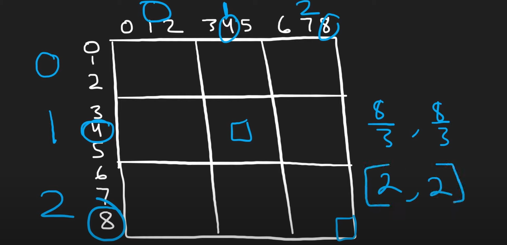

## 🚎 描述
请你判断一个 9 x 9 的数独是否有效。只需要 根据以下规则 ，验证已经填入的数字是否有效即可。

- 数字 1-9 在每一行只能出现一次。
- 数字 1-9 在每一列只能出现一次。
- 数字 1-9 在每一个以粗实线分隔的 3x3 宫内只能出现一次。（请参考示例图）
 

注意：

- 一个有效的数独（部分已被填充）不一定是可解的。
- 只需要根据以上规则，验证已经填入的数字是否有效即可。
- 空白格用 '.' 表示。
 

示例 1：

输入：board = 
[["5","3",".",".","7",".",".",".","."]
,["6",".",".","1","9","5",".",".","."]
,[".","9","8",".",".",".",".","6","."]
,["8",".",".",".","6",".",".",".","3"]
,["4",".",".","8",".","3",".",".","1"]
,["7",".",".",".","2",".",".",".","6"]
,[".","6",".",".",".",".","2","8","."]
,[".",".",".","4","1","9",".",".","5"]
,[".",".",".",".","8",".",".","7","9"]]

输出：true

<br>
<br>
 
## 🛶 自写
#### 🧱 思路总结
- 利用列表集合（列表里的元素是集合）记录每一列和每一组（3X3）是否有重复的数字
- 利用集合记录每一行是否有重复的数字
- 遍历`board`，对每一个数都进行三次判断（行、列、组）
<br>
 
#### 🏖 代码
```
class Solution(object):
    def isValidSudoku(self, board):
        """
        :type board: List[List[str]]
        :rtype: bool
        """
        # colset = set()
        collist = [set() for i in range(9)]
        grouplist = [set() for i in range(9)]


        for i in range(9):
            rowset = set()
            for j in range(9):
                if board[i][j] == ".":
                    continue
                if (board[i][j] in rowset) or (board[i][j] in collist[j]) or (board[i][j] in grouplist[(i//3)*3 + j//3 ]):
                    return False
                else:
                    rowset.add(board[i][j])
                    collist[j].add(board[i][j])
                    grouplist[(i//3)*3 + j//3 ].add(board[i][j])
        return True
```
<br>
<br>
<br>
 
## 🛫 参考
#### 🌒 解题思路：
```
class Solution:
    def isValidSudoku(self, board: List[List[str]]) -> bool:
        cols = collections.defaultdict(set)
        rows = collections.defaultdict(set)
        squares = collections.defaultdict(set)  # key = (r /3, c /3)

        for r in range(9):
            for c in range(9):
                if board[r][c] == ".":
                    continue
                if (
                    board[r][c] in rows[r]
                    or board[r][c] in cols[c]
                    or board[r][c] in squares[(r // 3, c // 3)]
                ):
                    return False
                cols[c].add(board[r][c])
                rows[r].add(board[r][c])
                squares[(r // 3, c // 3)].add(board[r][c])

        return True

```
 
<br>
<br>
<br>
 
 
## 🐾 解题过程中的疑惑
> 怎么用代码描述出 9×9 中的 3×3 小宫格

利用整除的方法，利用整除3：

> 怎么使列表里的元素是集合

利用 列表推导式/列表解析式 ：`[set() for i in range(9)]`
 
<br>
<br>
<br>
 
## 🍉 python 语法学习
>### 🍇  创建列表集合
>#### 描述
利用列表解析式
>#### 语法
`[set() for i in range(9)]`
 
<br>
 
>### 🍈 `collections.defaultdict`类
>#### 描述
它的其他功能与`dict`相同，但会为一个不存在的键提供默认值，从而避免KeyError异常。
>#### 语法
导入collections模块并调用collections.defaultdict()，传递数据类型作为默认值，就可以创建一个默认的字典。

```
import collections
d1 = collections.defaultdict(int)    # 表示 d1 中的 key 的数据类型为 int
d2 = collections.defaultdict(list)   # 表示 d2 中的 key 的数据类型为 list
```
除了int外，也可以用list，tuple，dict，set等作为变量
 

<br>
<br>
<br>
 
## 🌊 反思环节
九宫格下标间的的映射，可以考虑用整除的方法
