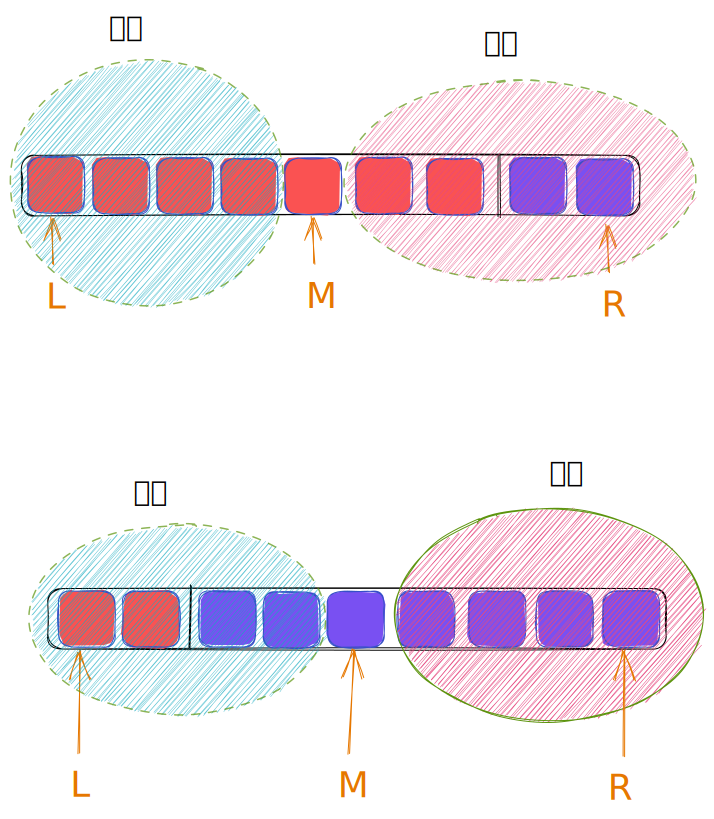

## 🚎 描述

整数数组 nums 按升序排列，数组中的值 互不相同 。

在传递给函数之前，nums 在预先未知的某个下标 k（0 <= k < nums.length）上进行了 旋转，使数组变为 [nums[k], nums[k+1], ..., nums[n-1], nums[0], nums[1], ..., nums[k-1]]（下标 从 0 开始 计数）。例如， [0,1,2,4,5,6,7] 在下标 3 处经旋转后可能变为 [4,5,6,7,0,1,2] 。

给你 旋转后 的数组 nums 和一个整数 target ，如果 nums 中存在这个目标值 target ，则返回它的下标，否则返回 -1 。

你必须设计一个时间复杂度为 O(log n) 的算法解决此问题。

<br>
<br>
 
## 🛶 自写
#### 🧱 思路总结
- **判断`target`的范围**
  - 在前面大的部分(`target > nums[len(nums)-1]`)
  - 还是后面小的部分(`target < nums[0]`)
- **在大的部分**：从前往后遍历，直到旋转点(数组中最小的元素)
- **在小的部分**：从后往前遍历，直到旋转点(数组中最小的元素)
  
<br>
 
#### 🏖 代码

```python

class Solution(object):
    def search(self, nums, target):
        """
        :type nums: List[int]
        :type target: int
        :rtype: int
        """
        if nums[len(nums)-1] < target:
            for i in range(len(nums)):
                if nums[i] == target:
                    return i
                if nums[i] < nums[i-1]:
                    break
            return -1
        else:
            for j in range(len(nums)-1,-1,-1):
                if nums[j] == target:
                    return j
                if  nums[j] <= nums[j-1]:
                    break
            return -1
            
```

<br>
<br>
<br>
 
## 🛫 参考
#### 🌒 解题思路一：
利用二分搜索法：


```python
class Solution:
    def search(self, nums: List[int], target: int) -> int:
        l, r = 0, len(nums) - 1

        while l <= r:
            mid = (l + r) // 2
            if target == nums[mid]:
                return mid

            # left sorted portion
            if nums[l] <= nums[mid]:
                if target > nums[mid] or target < nums[l]:
                    l = mid + 1
                else:
                    r = mid - 1
            # right sorted portion
            else:
                if target < nums[mid] or target > nums[r]:
                    r = mid - 1
                else:
                    l = mid + 1
        return -1

```

 
<br>
<br>
<br>
 
## 🌊 反思环节
边界处理
 